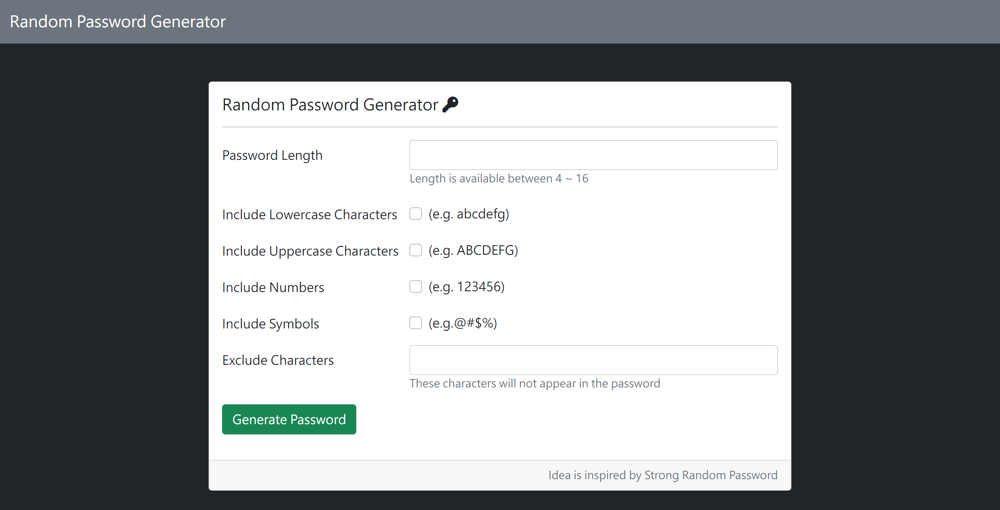

# Password Generator

## Project Image



## Project Features

### You can selector condition to generate password.

- password length
- lowercase
- uppercase
- numbers
- symbols
- excludeCharacters

## Environment

- node.js
- npm

## Install step

1.clone this project

```
git clone https://github.com/ReneeTsai/generate-password.git
```

2.終端機輸入指令進入專案資料夾

```
cd restaurantList
```

3.install npm / express / express-handlebars@3.0.0

```
npm install
```

```
npm i express
```

```
npm i express-handlebars@3.0.0
```

4.uccess on terminal : "The express server is running on localhost:3000"

```
nodemon app.js

```

5.open web

```

http://localhost:3000

```

## 開發工具

- node.js
- npm
- express 4.18.2
- express-handlebars 3.0.0
